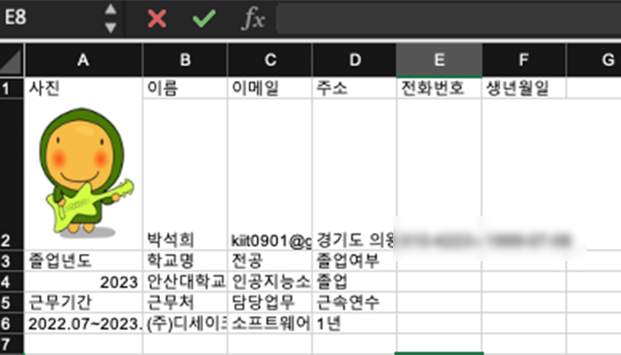

# 이력서 자동생성 프로그램

> 이력 정보와 자기소개서를 입력 받아서 Excel 파일을 생성하는 프로그램

Java와 여러 API를 활용하여 콘솔로부터 데이터를 입력받아 이력서와 자기소개서 엑셀 파일을 자동으로 생성해주는 프로젝트입니다.



## 구현 기능

```사용자 콘솔로부터 데이터 입력 ```

- ResumeView 클래스의 input 메서드들을 활용하여 사용자의 개인정보 / 학력정보 / 이력정보 / 자기소개서 데이터를 입력 받음.

```입력받은 데이터를 Model 클래스에 저장```

- 입력받은 각 데이터(개인정보, 학력정보, 이력정보)를 각각 PersonInfo, Education, Career 클래스에 저장.

```데이터를 바탕으로 이력서, 자기소개서 엑셀 파일 생성```

- 저장된 데이터를 모델로 부터 불러와 데이터 가공후 엑셀에 삽입.
- 프로젝트 내에 저장시킨 이미지 파일의 이름을 입력받아, 이미지 가공 및 삽입.
- 완성된 엑셀을 프로젝트 내에 출력 및 저장.

## 사용 예제


## 업데이트 내역

### [CHANGELOG.md](https://github.com/stoneHee99/AutomaticResumeGenerator/blob/main/CHANGELOG.md) 참조

## 개발 도구


